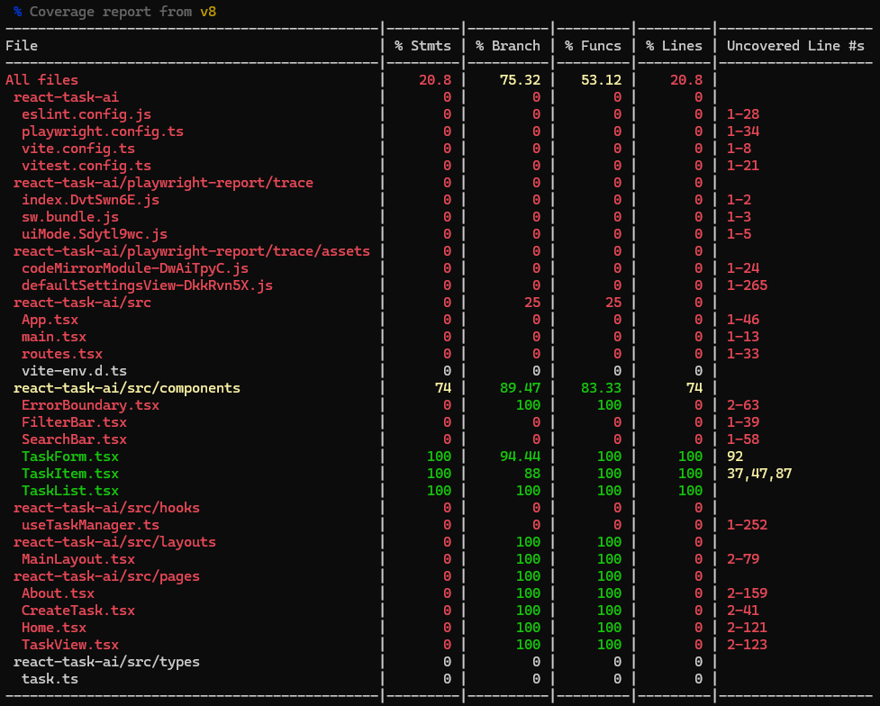

# Vibe Coding - Tasks List

A modern task management application built with React and TypeScript, developed using Prompt Engineering (Vibe Coding). The application code, tests, and content are primarily generated through AI assistance using Cursor and Google Gemini.

## About

This is a personal project demonstrating modern web development techniques. It's a feature-rich task management application that allows users to effectively organize and track their tasks.

### Key Features

- **Task Management:** Create, read, update, and delete tasks with a clean, intuitive interface
- **Search & Filtering:** Real-time search and archive filtering capabilities
- **Task Archiving:** Keep your active list organized by archiving completed tasks
- **Data Persistence:** Automatic task saving to local storage
- **Responsive Design:** Seamless experience across all device sizes
- **Accessibility:** Full keyboard navigation with ARIA support

## Demo

## Technical Stack

- **Frontend:** React 18 with TypeScript
- **Build Tool:** Vite
- **UI Framework:** Chakra UI
- **Routing:** React Router v6
- **Testing:** Vitest and React Testing Library for unit tests, Playwright for E2E

## Getting Started

### Prerequisites

- Node.js
- npm (Node Package Manager)

### Installation

1. Clone the repository
2. Install dependencies: `npm install`.

## Development

### Building the demo application (not production ready)

To build and run a local version of this app: `npm run dev`. Open your browser to http://localhost:5173.

### Running Tests

Unit/E2E Tests were generated using a combination of prompt engineering and manual intervention.

#### Unit Tests
- Run tests in watch mode: `npm test`
- Run tests with coverage: `npm run test:coverage`
- Run tests once: `npm run test:run`

##### Unit Test Coverage

The test coverage report reports positively for most code that should have unit tests.

#### E2E Tests
- Run E2E tests with UI: `npm run test:e2e:ui`
- Debug E2E tests: `npm run test:e2e:debug`
- View E2E test report: `npm run test:e2e:report`

##### E2E Test Report

I've left some failures in here to highlight the challenges around prompt engineering for E2E. It could also be an area for my own improvement and additionally in the tooling to enable this. 

